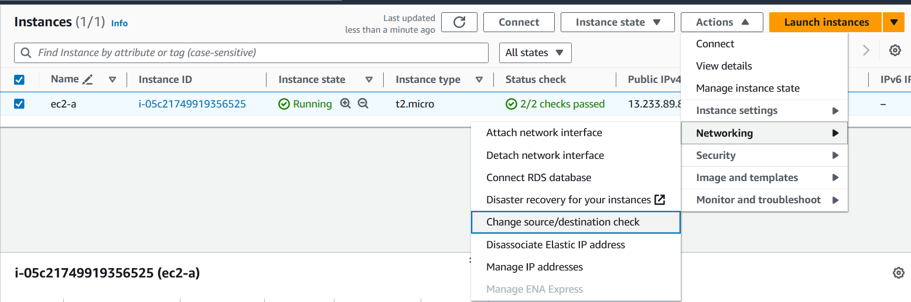

# AWS Site-to-Site VPN
Extend your on-premises networks to the cloud


- AWS Site-to-Site VPN is a **fully-managed service** that creates a **secure connection between your data center or branch office and your AWS resources using IP Security (IPSec) tunnels**

    
    <!--  -->

    <!--  -->

## Key Terminologies

- `VPN connection`: A **secure connection between your on-premises equipment and your VPCs**.


- `Customer gateway`: It is the **VPN endpoint on the On-premise side of Site-to-Site VPN connection**. Its is an AWS resource which provides information to AWS about your customer gateway device. 

- `Customer gateway device`: A physical device or software application on On-premise side of the Site-to-Site VPN connection.


- `Virtual private gateway`: A virtual private gateway is the **VPN endpoint on the AWS side of Site-to-Site VPN connection** that can be attached to a single VPC.

- `VPN tunnel`: An encrypted link where data can pass from the customer network to or from AWS.
    - Each VPN connection includes two VPN tunnels which you can simultaneously use for high availability.

- `Transit gateway`: A **transit hub that can be used to interconnect multiple VPCs and on-premises networks**, and as a VPN endpoint for the Amazon side of the Site-to-Site VPN connection.


## Setting up Site-to-Site VPN

1. Pre-Requisites

    - **On-premises IP address**: Public IP address of your customer gateway (your on-premises VPN device).
    - **Routing type**: Decide whether to use static routing (you specify routes) or dynamic routing using Border Gateway Protocol (BGP).
    - **AWS VPC**: Virtual Private Cloud (VPC) set up in your AWS account where the VPN will be setup.

2. Configuration on AWS Side
    - Create a virtual private gateway
    - Create a customer gateway
    - Configure routing
    - Update your security group
    - Create a VPN connection
    - Download the configuration file

3. Configuration on On-Premise Side
    
    - Configure the customer gateway device


## Site-to-Site VPN Hands-On

- ### What are we building ?

    


1. ### Simulating On-premises data center
    - AWS Region : Mumbai (ap-south-1)
    - VPC
        - Create VPC with CIDR : 172.31.0.0/16
        - Create public subnet : 172.31.0.0/20
        - Create private subnet : 172.31.128.0/20

            

            


    - EC2
        - Launch Amazon Linux 2 Instance in the public subnet of the the custom VPC created.
        - Stop source/destination checks for this EC2
            
            

            

        - Security Group for EC2
            - Allow ssh on port 22 from MyIP ( your own IP)
            - Allow ICMP from AWS VPC CIDR ( 10.0.0.0/16)
            - Allow ssh on port 22 from AWS VPC CIDR ( 10.0.0.0/16)

            

    - Configuring OpenSwan

        - Connect to EC2 Instance
        - Run the following command to install openswan
            ```
            sudo su
            yum update -y
            yum install openswan -y
            ```
        - Edit the config file *`/etc/sysctl.conf`* to add below lines  
            ```
            net.ipv4.ip_forward = 1
            net.ipv4.conf.all.accept_redirects = 0
            net.ipv4.conf.all.send_redirects = 0
            ```
        - Restart network service
            ```
            service network restart
            ```
        - We still need to configure *`/etc/ipsec.d/aws.conf`* file, we will do this post VPC setup on AWS. 

2. ### Configuration on AWS Side
    - AWS Region : N.Virginia (us-east-1)
    - VPC
        - Create VPC with CIDR : 10.0.0.0/16
        - Create public subnet : 10.0.0.0/20
        - Create private subnet : 10.0.128.0/20
            
            

            

    - EC2
        - Launch Amazon Linux 2 Instance in the public subnet of the the custom VPC created.
            
            

        - Security Group for EC2
            - Allow ssh on port 22 from MyIP (your own IP)
            - Allow ssh on port 22 from On-prem CIDR ( 172.31.0.0/16)
            - Allow ICMP from On-prem CIDR (172.31.0.0/16)
           
            


- ### Lets do a simple ping test
    
    - Both network are not reachable 

        

### Setting up Site-to-Site VPN Connection

- Create a Virtual Private Gateway and attach it to AWS VPC
    

- Create a Customer Gateway and attach it to AWS VPC
    - IP Address = Public IP of VPN device , our case Public IP of EC2 hosted in Mumbai region
    - IP Address = 13.233.89.88

    
    
- Create site-to-site VPN Connection

    

    
    
- Wait for site-to-site VPN to be provisioned

    


3. ### Configuration on On-Premise Side
    
    - Configure the customer gateway device
    - Download the configuration file from VPN Console
        
        

    - Create the config file *`/etc/ipsec.d/aws.conf`* to add below lines  

         ```
        conn Tunnel1
                authby=secret
                auto=start
                left=%defaultroute
                leftid=<Public IP of OpenSwan/CGW, pub ip of EC2 instance in mumbai>
                right=<Public IP of VGW - Tunnel 1, get from VPN tunnel details>
                type=tunnel
                ikelifetime=8h
                keylife=1h
                phase2alg=aes128-sha1;modp1024
                ike=aes128-sha1;modp1024
                keyingtries=%forever
                keyexchange=ike
                leftsubnet=<On-prem Network CIDR>
                rightsubnet=<AWS VPC CIDR>
                dpddelay=10
                dpdtimeout=30
                dpdaction=restart_by_peer
        ```
    - Example for my current setup 
         ```
        conn Tunnel1
                authby=secret
                auto=start
                left=%defaultroute
                leftid=13.233.89.88
                right=34.202.212.171
                type=tunnel
                ikelifetime=8h
                keylife=1h
                phase2alg=aes128-sha1;modp1024
                ike=aes128-sha1;modp1024
                keyingtries=%forever
                keyexchange=ike
                leftsubnet=172.31.0.0/16
                rightsubnet=10.0.0.0/16
                dpddelay=10
                dpdtimeout=30
                dpdaction=restart_by_peer

        ```

    - Add the shared secret in file *`/etc/ipsec.d/aws.secrets`*
        - You should find the shared key in downloaded VPN configuration file as “Pre-Shared Key” under Tunnel 1 - IKE configuration section. 
        - The format of the file is:   
        *\<customer public ip> \<aws vpg public ip>: PSK "\<shared secret>"*

        - our case :
            ```
            13.233.89.88 34.202.212.171: PSK "9d11R8zqe9xRWbALjD6I3O3qq6BYEGN7"
            ```

    - Configure ipsec service to be ON on reboot 

        ```
        chkconfig ipsec on
        ```


    - Start *`ipsec`* service
    
        ```
        systemctl start ipsec
        systemctl status ipsec
        ```
    
        


    - Enable Route Propagation

        - on the **AWS VPC Public Subnets Route table** you need to enable route propagation 
        
            

            
        
        - Once the route propagation is enabled you should see the routes automatically added to route table

            
    
    - Validate VPN Connection
        - You should now be able to see the tunnel 1 UP

            


- ### Lets do a simple ping test
    
    - As you can see you can now ping both network :)  

        

- ### Testing SSH 

    - Copy the pem files to EC2 Onprem and AWS EC2 and test the login via ssh

        

## Resource Cleanup

- Delete EC2 in both regions
- Delete EC2 Security Group
- Delete key-pair (if no longer required)
- Delete VPN connection
- Delete VGW
- Delete CGW
- Delete VPC in both regions


## Pricing
- **Not Free tier eligible**
- You are charged for each **VPN connection-hour** that your VPN connection is provisioned and available.
- Each partial VPN connection-hour consumed is billed as a full hour. 
- You are charged for **standard AWS data transfer charges** for all data transferred via the VPN connection. 
- If you no longer wish to be charged for a VPN connection, simply terminate your VPN connection

- Approximate pricing for hands-on lab is : **$0.40** or **INR 40**.

    


## References :


https://docs.aws.amazon.com/vpn/latest/s2svpn/SetUpVPNConnections.html

https://github.com/xelerance/Openswan/wiki/Amazon-ec2-example#remote-endpoint-config

https://aws.amazon.com/vpn/site-to-site-vpn/

https://docs.aws.amazon.com/whitepapers/latest/aws-vpc-connectivity-options/aws-site-to-site-vpn.html

https://aws.amazon.com/blogs/networking-and-content-delivery/simulating-site-to-site-vpn-customer-gateways-strongswan/

